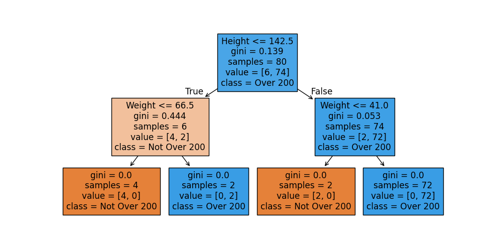

# decision-tree-api-fastapi
API sederhana menggunakan FastAPI dan Decision Tree Classifier untuk memprediksi apakah tinggi + berat badan seseorang melebihi 200.

# 📦 Decision Tree Classification API

Proyek ini merupakan implementasi sederhana dari **Decision Tree Classification** menggunakan `scikit-learn`, yang dilatih pada dataset buatan berdasarkan kombinasi tinggi dan berat badan. Model ini dipublikasikan sebagai **REST API menggunakan FastAPI**, memungkinkan pengguna mengirim data tinggi dan berat badan, lalu menerima prediksi apakah jumlahnya melebihi 200.

## 🚀 Fitur

- [✓] Membuat dataset sintetik (tinggi dan berat badan)
- [✓] Training model Decision Tree Classifier
- [✓] Simpan model ke file `.pkl`
- [✓] Endpoint API untuk prediksi

## 📁 Struktur Proyek

```
.
├── app.py                      # FastAPI server (endpoint /predict)
├── main.py                     # Training model dan save ke pickle
├── requirements.txt            # Daftar dependency Python
├── .gitignore                  # File/folder yang diabaikan Git
└── models/
    └── decision_tree_model.pkl # File model hasil training
```

## ⚙️ Instalasi

```bash
# 1. Clone repository ini
git clone https://github.com/username/decision-tree-api-fastapi.git
cd decision-tree-api-fastapi

# 2. Install dependensi
pip install -r requirements.txt

# 3. Jalankan training untuk membuat model
python main.py

# 4. Jalankan server API
uvicorn app:app --reload
```

## 📬 API Endpoint

### POST `/predict`

#### Request Body
```json
{
  "height": 170,
  "weight": 55
}
```

#### Response
```json
{
  "prediction": "Over 200"
}
```

## 📊 Visualisasi

`main.py` menghasilkan visualisasi pohon keputusan menggunakan `plot_tree()` dari `sklearn.tree`:



## 🧠 Teknologi yang Digunakan

- Python 3.x
- scikit-learn
- FastAPI
- Pickle
- Matplotlib
- NumPy & Pandas

## 📌 Lisensi

Proyek ini dilisensikan di bawah lisensi MIT — bebas digunakan, dimodifikasi, dan dibagikan.

---

Created with by arielshakaramiro
